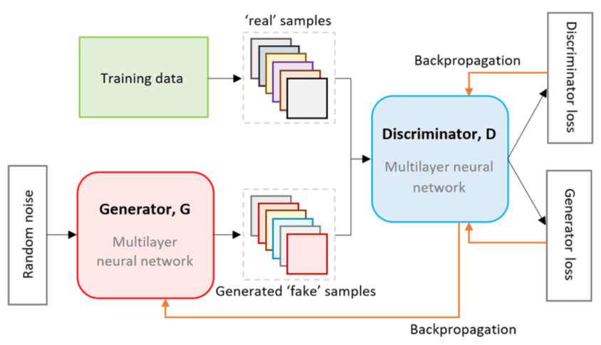
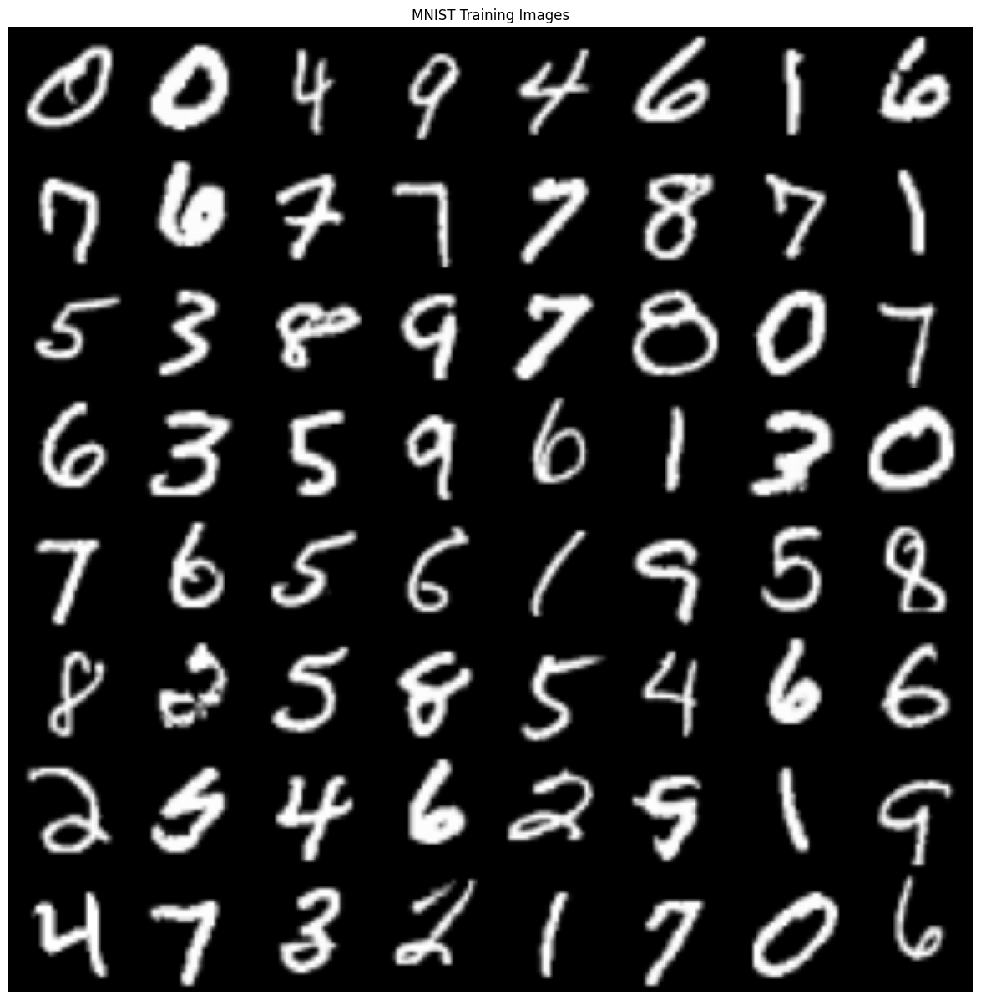
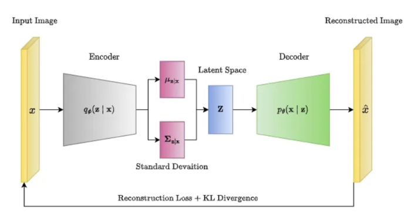
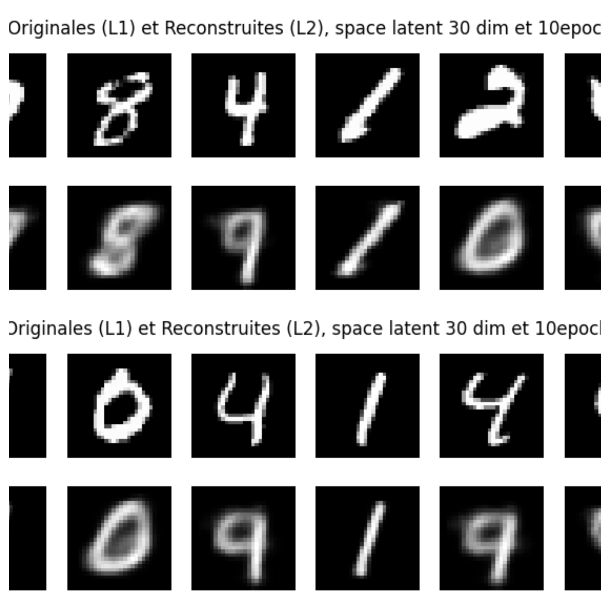

## Overview

**Type:** Practical coursework of *S. Lamprier*  
**Author:** <u>M. Mahamat</u>  
**Duration:** November 2024 – December 2024

---

## Context

This project covers the implementation and experimentation of two fundamental **deep generative model** families:

- **GAN** : Generative Adversarial Networks
- **VAE** : Variational Autoencoders

Both approaches are trained on standard datasets (**MNIST**, **CelebA**) and evaluated through visual inspection of generated samples and latent space analysis.

---

## Generative Adversarial Network

### Principle

A GAN frames generation as a **two-player minimax game** between:

<table style="width:100%; border-collapse:collapse; font-size:0.95rem;">
  <thead>
    <tr style="background-color:#5b5b5b;">
      <th style="border:1px solid #ccc; padding:10px 14px; text-align:left;">Network</th>
      <th style="border:1px solid #ccc; padding:10px 14px; text-align:left;">Role</th>
      <th style="border:1px solid #ccc; padding:10px 14px; text-align:left;">Objective</th>
    </tr>
  </thead>
  <tbody>
    <tr>
      <td style="border:1px solid #ccc; padding:10px 14px;"><strong>Generator</strong> $G$</td>
      <td style="border:1px solid #ccc; padding:10px 14px;">Generates fakes samples</td>
      <td style="border:1px solid #ccc; padding:10px 14px;">Fool $D$</td>
    </tr>
    <tr>
      <td style="border:1px solid #ccc; padding:10px 14px;"><strong>Discriminator</strong> $D$</td>
      <td style="border:1px solid #ccc; padding:10px 14px;">Classifies real vs. generated</td>
      <td style="border:1px solid #ccc; padding:10px 14px;">Detect fakes</td>
    </tr>
  </tbody>
</table>

The training objective is:

$$
\min_G \max_D \;
\mathbb{E}_{x \sim p_\text{data}}\!\left[\log D(x)\right]
+
\mathbb{E}_{z \sim p_z}\!\left[\log(1 - D(G(z)))\right]
$$

### Architecture

  

### Variant explored

<table style="width:100%; border-collapse:collapse; font-size:0.95rem;">
  <thead>
    <tr style="background-color:#5b5b5b;">
      <th style="border:1px solid #ccc; padding:10px 14px; text-align:left;">Variant</th>
      <th style="border:1px solid #ccc; padding:10px 14px; text-align:left;">Key idea</th>
    </tr>
  </thead>
  <tbody>
    <tr>
      <td style="border:1px solid #ccc; padding:10px 14px;"><strong>DCGAN</strong></td>
      <td style="border:1px solid #ccc; padding:10px 14px;">Convolutional layers, batch norm, more stable training</td>
    </tr>
  </tbody>
</table>

  

### Generated samples — MNIST

  

> - Training instability analysis (mode collapse, vanishing gradients)
> - Visual inspection of generated samples across epochs

---

## Variational Autoencoder

### Principle

A VAE is a **probabilistic generative model** that learns a structured latent space by maximising the **Evidence Lower Bound (ELBO)**:

$$
\mathcal{L}(\theta, \phi) =
\mathbb{E}_{q_\phi(z \mid x)}\!\left[\log p_\theta(x \mid z)\right]
- D_\text{KL}\!\left(q_\phi(z \mid x) \;\|\; p(z)\right)
$$

<table style="width:100%; border-collapse:collapse; font-size:0.95rem;">
  <thead>
    <tr style="background-color:#5b5b5b;">
      <th style="border:1px solid #ccc; padding:10px 14px; text-align:left;">Term</th>
      <th style="border:1px solid #ccc; padding:10px 14px; text-align:left;">Role</th>
    </tr>
  </thead>
  <tbody>
    <tr>
      <td style="border:1px solid #ccc; padding:10px 14px;">Reconstruction term</td>
      <td style="border:1px solid #ccc; padding:10px 14px;">Forces the decoder to recover $x$</td>
    </tr>
    <tr>
      <td style="border:1px solid #ccc; padding:10px 14px;">KL divergence</td>
      <td style="border:1px solid #ccc; padding:10px 14px;">Regularises the latent space toward $\mathcal{N}(0, I)$</td>
    </tr>
    <tr>
      <td style="border:1px solid #ccc; padding:10px 14px;">Reparametrisation trick</td>
      <td style="border:1px solid #ccc; padding:10px 14px;">Enables backprop through sampling</td>
    </tr>
  </tbody>
</table>

### Architecture

  

The encoder outputs parameters $(\mu, \sigma)$ of a Gaussian distribution. A latent vector $z$ is sampled via the reparametrisation trick and decoded back into data space.

### Generated samples — MNIST

  

> - Latent space visualisation in $\mathbb{R}^2$ projections via a dimension reduction (PCA)

---

## GAN vs. VAE

<table style="width:100%; border-collapse:collapse; font-size:0.95rem;">
  <thead>
    <tr style="background-color:#5b5b5b;">
      <th style="border:1px solid #ccc; padding:10px 14px; text-align:left;">Property</th>
      <th style="border:1px solid #ccc; padding:10px 14px; text-align:center;">GAN</th>
      <th style="border:1px solid #ccc; padding:10px 14px; text-align:center;">VAE</th>
    </tr>
  </thead>
  <tbody>
    <tr>
      <td style="border:1px solid #ccc; padding:10px 14px;">Sample sharpness</td>
      <td style="border:1px solid #ccc; padding:10px 14px; text-align:center;">High</td>
      <td style="border:1px solid #ccc; padding:10px 14px; text-align:center;">Blurry</td>
    </tr>
    <tr>
      <td style="border:1px solid #ccc; padding:10px 14px;">Training stability</td>
      <td style="border:1px solid #ccc; padding:10px 14px; text-align:center;">Unstable</td>
      <td style="border:1px solid #ccc; padding:10px 14px; text-align:center;">Stable</td>
    </tr>
    <tr>
      <td style="border:1px solid #ccc; padding:10px 14px;">Latent structure</td>
      <td style="border:1px solid #ccc; padding:10px 14px; text-align:center;">No explicit space</td>
      <td style="border:1px solid #ccc; padding:10px 14px; text-align:center;">Structured</td>
    </tr>
    <tr>
      <td style="border:1px solid #ccc; padding:10px 14px;">Likelihood estimate</td>
      <td style="border:1px solid #ccc; padding:10px 14px; text-align:center;">Implicit</td>
      <td style="border:1px solid #ccc; padding:10px 14px; text-align:center;">Via ELBO</td>
    </tr>
    <tr>
      <td style="border:1px solid #ccc; padding:10px 14px;">Mode coverage</td>
      <td style="border:1px solid #ccc; padding:10px 14px; text-align:center;">Mode collapse risk</td>
      <td style="border:1px solid #ccc; padding:10px 14px; text-align:center;">Better coverage</td>
    </tr>
  </tbody>
</table>

---

  <a href="{{ page.github }}" class="btn btn-primary" role="button" target="_blank">
    <i class="fab fa-github"></i> More details on GitHub
  </a>
  <a href="https://github.com/mahamat9/Generative-Models/blob/main/Mod%C3%A8les_Generatifs_report.pdf"
     class="btn btn-secondary" role="button" target="_blank">
    Read the report
  </a>

